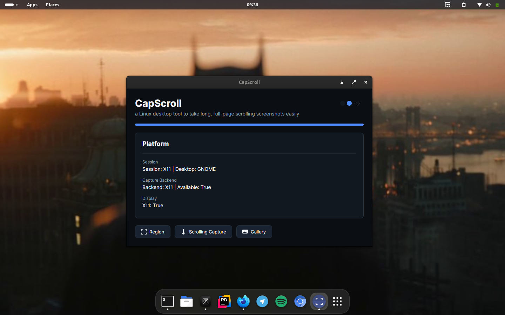
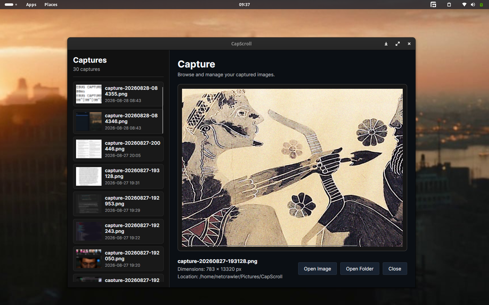
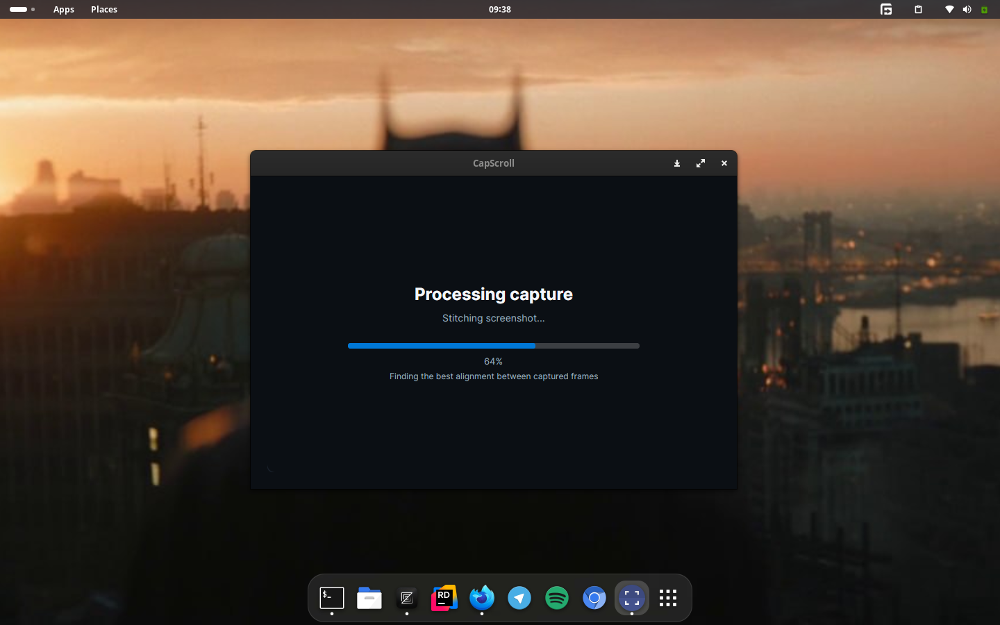

<h1>
  
  CapScroll
</h1>

A linux scrolling screenshot tool built with .NET and Avalonia UI

[](https://dotnet.microsoft.com/)
[](https://learn.microsoft.com/dotnet/csharp/)
[](https://avaloniaui.net/)
[](https://www.linux.org/)
[](https://www.x.org/)
[](LICENSE)

CapScroll is a screenshot tool for Linux that makes it easy to capture screen regions and create long screenshots from not only from browsers but also from all scrollable contents.

Provides a simple way to capture content that extends beyond the visible screen, such as long documents, web pages, terminal output, and other scrollable applications.

CapScroll currently uses **X11** for screen capture and input simulation.

> [!NOTE]
> Scrolling capture uses simulated mouse-wheel input to scroll the selected content.

## Overview

CapScroll supports both regular screenshots and scrolling screenshots.

For scrolling captures, CapScroll automatically:

- Captures the selected region.
- Scrolls the content.
- Captures subsequent frames.
- Detects when the end of the content is reached.
- Detects the overlap between frames.
- Stitches the frames into a single image.

The goal is to make long screenshots as simple as selecting an area and letting CapScroll handle the rest.

## Demo

> [!NOTE]
> Watch CapScroll in action with a scrolling screenshot demonstration.

[**▶ Watch Demo**](https://drive.google.com/file/d/1aLgQzf764prA_aX1Y7y1hyhJgYGu5rjU/view?usp=sharing)

## Screenshots

<table>
  <tr>
    <td width="100%">
      
    </td>
  </tr>
  <tr>
    <td width="100%">
      
    </td>
  </tr>
  <tr>
    <td width="100%">
      
    </td>
  </tr>
</table>

## Features

- Region capture
- Scrolling capture
- Automatic scrolling
- Automatic bottom detection
- Automatic frame stitching
- Capture cancellation
- Capture progress
- Capture preview
- Open captured image
- Open capture folder
- PNG output
- Debian package support

## Supported Content

CapScroll can be useful for capturing:

- Web pages
- PDF documents
- Terminal output
- Long application views
- Literally any scrollable content

> [!NOTE]
> Results may vary depending on how the target application handles scrolling and renders its content.

## Requirements

- Linux
- .NET 10
- X11 session
- `libX11`
- `libXtst`

### Currently Tested On

- Kali Linux, Linux Mint, Ubuntu
- GNOME, KDE, XFCE (x11 sessions)

> [!NOTE]
> CapScroll currently requires an **X11 session** for scrolling capture.

> [!NOTE]
> Wayland is not currently supported. Wayland support is planned for a future release.

> [!TIP]
> Desktop environments such as GNOME, KDE, and XFCE must be running an X11 session, not a Wayland session.

## Installation

### Debian Package

Download the `.deb` package from the project's releases and install it with:

```bash
sudo apt install ./capscroll_1.0.0_amd64.deb
```

### Build From Source

Clone the repository:

```bash
git clone https://github.com/netcrawlerr/CapScroll.git
cd CapScroll
```

Run the build script:

```bash
scripts/build.sh

scripts/install.sh
```

## How to Use

### Normal Capture

1. Start CapScroll.
2. Select **Capture Region**.
3. Select the area to capture.
4. CapScroll captures the selected region.
5. The image is saved automatically.

### Scrolling Capture

1. Select **Scrolling Capture**.
2. Select the scrollable area.
3. CapScroll captures the initial view.
4. CapScroll automatically scrolls the content and captures additional frames.
5. The captured frames are automatically aligned and stitched together.
6. The completed long screenshot is displayed when the capture finishes.

> [!TIP]
> Keep the mouse pointer inside the selected capture area while scrolling capture is running.

### Stop Scrolling Capture

Press:

```text
Ctrl + Shift + Esc

or

Move the mouse pointer out of the selected capture area.
```

> [!NOTE]
> Moving the pointer outside the selected capture area stops the scrolling capture because CapScroll uses the pointer position to determine where to send the scrolling input.

## Output

Captured images are saved as PNG files.

By default, captures are stored in:

```text
~/Pictures/CapScroll/
```

## Current Limitations

CapScroll currently focuses on **Linux/X11**.

Currently unsupported:

- Wayland
- Windows
- macOS

> [!NOTE]
> Scrolling capture relies on simulated mouse-wheel input, so applications with unusual scrolling behavior or dynamically changing content may not produce perfect results.

> [!TIP]
> Wayland support is planned, but the current implementation depends on X11 APIs and the XTest extension.

## License

CapScroll is licensed under the [MIT License](LICENSE).
